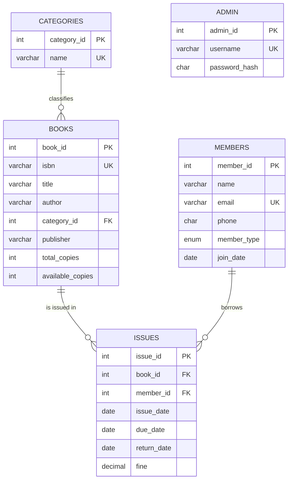

# Library Management System (DBMS Mini Project)

A desktop application for running a college library. Librarians sign in, manage books and members, issue and return books, and see reports. The database enforces the library's rules itself through constraints, triggers and stored procedures, so the data stays correct even if someone bypasses the app.

**Tech stack:** Java (Swing GUI) + MySQL 8 via JDBC

**Login:** `admin` / `admin123`

## Output Screenshots


## Folder structure

```
LibraryManagementSystem/
├── database/
│   └── library_db.sql      tables, constraints, function, triggers, procedures, view, sample data
├── src/
│   ├── Main.java           start here
│   ├── DBConnection.java   MySQL URL / username / password  (edit this)
│   ├── AppUtil.java        shared helpers (tables, forms, error messages)
│   ├── LoginFrame.java     sign-in screen
│   ├── MainFrame.java      main window with tabs
│   ├── DashboardPanel.java summary numbers + recent issues
│   ├── BooksPanel.java     add / edit / delete / search books
│   ├── MembersPanel.java   add / edit / delete / search members
│   ├── IssuePanel.java     issue and return books (calls stored procedures)
│   └── ReportsPanel.java   7 SQL reports, with the query shown on screen
├── lib/                    put mysql-connector-j-x.x.x.jar here
├── run.bat                 Windows: compile + run
└── run.sh                  Linux / Mac: compile + run
```

## Setup (about 10 minutes)

### 1. Create the database
Open **MySQL Workbench**, connect to your local server, then **File → Open SQL Script → `database/library_db.sql`** and click the ⚡ (Execute) button.
The last result should show `12 books, 8 members, 15 issues`.

Command line alternative: `mysql -u root -p < database/library_db.sql`

### 2. Set your MySQL password
Open `src/DBConnection.java` and change `PASSWORD` (and `USER` if you don't use root).

### 3. Get the MySQL JDBC driver
Download **MySQL Connector/J** from https://dev.mysql.com/downloads/connector/j/ → choose **Platform Independent** → download the ZIP → take `mysql-connector-j-x.x.x.jar` out of it.

### 4. Run it

**Option A: run.bat (easiest, no IDE)**
Copy the jar into the `lib` folder, then double-click `run.bat` (Windows) or run `./run.sh` (Linux/Mac). Needs JDK 8 or newer installed (`javac -version` should work in a terminal).

**Option B: NetBeans**
1. File → New Project → Java with Ant → Java Application. Untick "Create Main Class".
2. Copy all files from `src/` into the project's `src` folder (default package).
3. Right-click **Libraries** → Add JAR/Folder → pick the connector jar.
4. Right-click `Main.java` → Run File.

**Option C: Eclipse**
1. File → New → Java Project (untick "Create module-info.java").
2. Drag the files from `src/` into the project's `src` folder.
3. Right-click project → Build Path → Add External Archives → pick the connector jar.
4. Right-click `Main.java` → Run As → Java Application.

**Option D: IntelliJ IDEA**
1. New Project → Java. Copy `src/` files into its `src` folder.
2. File → Project Structure → Libraries → + → Java → pick the connector jar.
3. Run `Main.java`.

## Demo flow (for the presentation)
1. Sign in with admin / admin123.
2. **Dashboard**: live counts, overdue books shaded red.
3. **Books**: add a book, click a row to edit it, search by title.
4. **Members**: add a member (email and 10-digit phone are validated).
5. **Issue / Return**: issue a book → watch the available count drop. Try issuing a 4th book to a student to show the borrowing limit error. Return an overdue book to show the fine calculation.
6. **Reports**: pick each report and explain the SQL shown on screen.
7. Try deleting a book that has issue history → the foreign key blocks it.

## Database design

### ER diagram



### Relationships
- One category has many books (1:N).
- Books and members have a many-to-many relationship (a member borrows many books, a book is borrowed by many members). The `issues` table resolves it into two 1:N relationships and also stores the attributes of the relationship itself (dates and fine).

### Normalisation (3NF)
- **1NF:** every column holds a single atomic value; no repeating groups.
- **2NF:** every table has a single-column primary key, so there are no partial dependencies.
- **3NF:** no non-key column depends on another non-key column. Category names live in `categories` instead of being repeated in every book row, and member details live in `members` instead of being repeated in every issue row.

### Business rules enforced by the database
| Rule | Where it's enforced |
|---|---|
| ISBN and member email must be unique | `UNIQUE` constraints |
| Available copies stay between 0 and total copies | `CHECK chk_copies` |
| Due/return date can't be before issue date | `CHECK chk_dates` |
| Can't delete a book or member with issue history | `FOREIGN KEY` (restrict) |
| Issuing reduces available copies | trigger `trg_after_issue` |
| Returning calculates the fine (Rs 5/day late) | trigger `trg_before_return` + function `calc_fine` |
| Returning restores the copy | trigger `trg_after_return` |
| Students hold max 3 books, faculty max 5; no issuing unavailable books; no duplicate copy to the same member | procedure `issue_book` using `SIGNAL` |
| Passwords are never stored as plain text | `SHA2(password, 256)` |

## DBMS concepts covered (and where to find them)

| Concept | Where |
|---|---|
| DDL: CREATE TABLE, constraints, indexes | `library_db.sql` section 1 |
| DML: INSERT, UPDATE, DELETE | Books and Members tabs |
| Primary, foreign, unique keys; CHECK; ENUM; DEFAULT | `library_db.sql` section 1 |
| Stored function | `calc_fine` |
| Stored procedures with IN and OUT parameters | `issue_book`, `return_book` |
| Triggers (BEFORE and AFTER) | `trg_after_issue`, `trg_before_return`, `trg_after_return` |
| Custom errors with SIGNAL | inside `issue_book`, `return_book` |
| View | `v_current_issues` |
| INNER JOIN, LEFT JOIN, 3-table join | Reports 2, 4, 7 |
| GROUP BY, HAVING, aggregate functions | Reports 3, 4, 5 |
| Subqueries (correlated, NOT EXISTS) | Members tab "Books Held", Report 6 |
| CASE expression | Reports 2, 5 |
| JDBC Statement, PreparedStatement, CallableStatement | Reports, Books/Members, Issue tab |
| SQL injection prevention | every user input goes through `PreparedStatement` |


## Troubleshooting
| Message | Fix |
|---|---|
| MySQL JDBC driver not found | Add the connector jar to `lib/` or to your IDE project's libraries. |
| MySQL rejected the username or password | Fix `USER` / `PASSWORD` in `DBConnection.java`. |
| Database 'library_db' not found | Run `database/library_db.sql` first. |
| Cannot connect to MySQL | Start the MySQL service (Windows: Services → MySQL80 → Start). |
| Error 1418 when running the SQL script | Run `SET GLOBAL log_bin_trust_function_creators = 1;` then run the script again. |
| `javac` is not recognized | Install a JDK and add its `bin` folder to PATH, or use an IDE (Option B/C/D). |

To reset all data back to the sample data, just run `library_db.sql` again.
